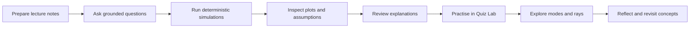
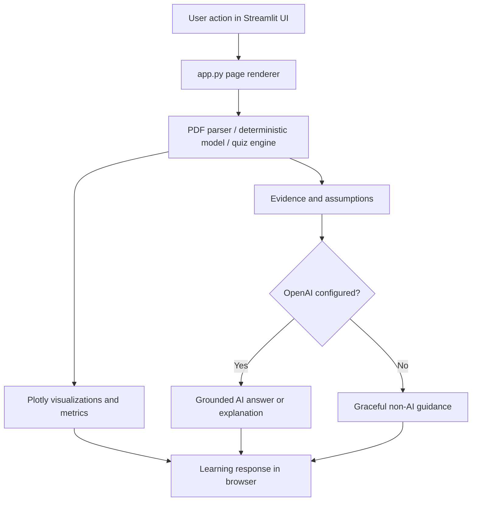

# OptiLearn AI

**AI-Powered Educational Digital Twin for Optical Communication**

**Version 1.0.0**

## Overview

OptiLearn AI is an interactive engineering-education platform for optical communication. It combines deterministic Python simulations, grounded tutoring from lecture notes, formative assessment, and interactive visualization of optical-fiber modes and ray propagation in one Streamlit workspace.

The platform helps learners move from reading equations to changing parameters, observing physical consequences, inspecting assumptions, and testing their understanding.

Most of the application works without OpenAI API access. Live grounded tutoring and live AI explanations require configured API access.

Repository URL: https://github.com/M-Khalid16/OptiLearn-AI

## Live Application

**Launch OptiLearn AI:**
https://optilearn-ai-h3dgt9c9onvohsxi2u2aa4.streamlit.app/

Most deterministic features work without OpenAI API access. Live grounded tutoring and live AI explanations require configured API access.

## Why OptiLearn AI

Students have access to more information than ever, but information alone does not create deep engineering understanding. Optical communication is particularly challenging because attenuation, dispersion, guided modes, beam spreading, coupling, and propagation are physically invisible and mathematically abstract.

OptiLearn AI is designed to support active learning by helping learners:

- question source material;
- manipulate engineering parameters;
- visualize cause and effect;
- compare physical models;
- inspect assumptions and limitations;
- practise with formative questions;
- connect mathematical results with physical meaning;
- revisit difficult concepts through structured exploration.

The platform is designed to support learning opportunities. It does not claim experimentally measured educational outcomes and does not replace laboratory teaching, expert supervision, or formal assessment.

## What the Application Does

OptiLearn AI guides learners through a practical engineering-learning workflow:

1. Prepare text-based lecture notes.
2. Preserve page-level provenance.
3. Ask evidence-grounded questions.
4. Run deterministic optical-link simulations.
5. Inspect plots, metrics, equations, and assumptions.
6. Request explanations of calculated evidence.
7. Practise with deterministic formative quizzes.
8. Explore LP modes, Gaussian launch coupling, meridional rays, and skew rays.
9. Revisit concepts based on observed results.

## Learner Workflow



## Technical Workflow



The application separates deterministic scientific calculations from optional OpenAI features. Python modules calculate link budgets, dispersion, modes, coupling, rays, quiz grading, and PDF extraction. OpenAI is used only for live grounded tutoring and live explanations when an API key is configured.

## Application Pages

The Streamlit sidebar exposes these pages in the final application order:

1. **Home** — professional landing page and workflow entry point.
2. **Lecture Notes** — upload text-based PDFs, inspect extracted pages, and preserve source provenance.
3. **Digital Twin** — run deterministic fiber attenuation, dispersion, and free-space optical link explorations.
4. **AI Tutor** — ask grounded questions over uploaded lecture-note passages when OpenAI access is configured.
5. **Quiz Lab** — practise deterministic formative questions without OpenAI.
6. **Mode Explorer** — explore LP modes, Gaussian launch coupling, meridional rays, and skew rays without OpenAI.

## Core Features

- Text-based lecture-note PDF extraction with page-level provenance.
- Deterministic fiber attenuation and received-power simulation.
- Deterministic chromatic-dispersion pulse-broadening simulation.
- Deterministic free-space optical link-budget exploration.
- Grounded AI Tutor that cites retrieved lecture-note evidence when API access is available.
- AI simulation explanations from calculated evidence when API access is available.
- Local Quiz Lab with deterministic grading and feedback.
- Mode Explorer for scalar LP modes, launch coupling, meridional rays, and skew rays.
- Demo-mode labels for transparent local demonstration behavior.
- No account system, database, learner tracking, or required API key for non-AI features.

## Scientific Models

OptiLearn AI uses educational deterministic approximations intended for learning and inspection:

- **Fiber attenuation:** received optical power versus distance using attenuation in dB/km.
- **Chromatic dispersion:** pulse broadening from dispersion coefficient, spectral width, and distance.
- **Free-space optical link budget:** transmitted power, geometric spreading, aperture collection, atmospheric attenuation, pointing loss, and received power.
- **LP mode exploration:** scalar weak-guidance approximations for optical-fiber mode shapes.
- **Gaussian launch coupling:** overlap-style educational estimate for coupling into supported modes.
- **Ray tracing:** idealized meridional and skew ray paths for geometric intuition.
- **Quiz Lab:** locally graded formative questions generated from deterministic question banks and simulation outputs.

These models are designed for conceptual education, not certified system design.

## Deterministic Python versus OpenAI

| Capability | Implementation | OpenAI required? |
| --- | --- | --- |
| PDF text extraction | Python + PyMuPDF | No |
| Fiber attenuation | Deterministic Python | No |
| Chromatic dispersion | Deterministic Python | No |
| FSO link budget | Deterministic Python | No |
| Quiz Lab grading | Deterministic Python | No |
| Mode Explorer | Deterministic Python + SciPy/NumPy | No |
| Plotting | Plotly | No |
| Grounded AI Tutor | OpenAI API over retrieved note evidence | Yes |
| Live simulation explanation | OpenAI API over calculated evidence | Yes |

ChatGPT Plus or a ChatGPT subscription is not the same as OpenAI API access. To enable live AI features, configure an OpenAI API key through environment variables or Streamlit secrets.

## System Requirements

- Python 3.10 or newer is recommended.
- Git for cloning the repository.
- A modern browser supported by Streamlit.
- Internet access for installing Python packages.
- Optional: OpenAI API access for live AI Tutor and live AI explanations.

The pinned dependency list is intentionally small and remains:

```text
streamlit
numpy
plotly
pymupdf
openai
scipy
```

## Local Installation

### Windows PowerShell

```powershell
git clone https://github.com/M-Khalid16/OptiLearn-AI.git
cd OptiLearn-AI
python -m venv .venv
.venv\Scripts\activate
python -m pip install --upgrade pip
python -m pip install -r requirements.txt
```

### macOS/Linux

```bash
git clone https://github.com/M-Khalid16/OptiLearn-AI.git
cd OptiLearn-AI
python3 -m venv .venv
source .venv/bin/activate
python -m pip install --upgrade pip
python -m pip install -r requirements.txt
```

## Launching the Application

From the repository root with the virtual environment activated:

```bash
streamlit run app.py
```

For headless local validation or remote terminals:

```bash
streamlit run app.py --server.headless true --server.port 8501
```

Then open the local URL shown by Streamlit, usually `http://localhost:8501`.

## Configuration

OpenAI access is optional. Without an API key, deterministic simulations, PDF extraction, Quiz Lab, and Mode Explorer remain available.

### Environment variables

Create local environment variables as needed:

```bash
OPENAI_API_KEY=""
OPENAI_MODEL=""
OPTILEARN_DEMO_MODE="false"
```

### Streamlit secrets

For Streamlit Community Cloud, use app secrets rather than committing keys:

```toml
OPENAI_API_KEY = ""
OPENAI_MODEL = "your-verified-model-name"
OPTILEARN_DEMO_MODE = "false"
```

Do not commit real API keys, `.env` files containing secrets, or Streamlit secrets files. Use a verified OpenAI model name only after confirming it for your deployment.

## Sample Lecture Notes

Sample project-authored notes are included for reviewers and learners:

- `examples/sample_optical_notes.md` contains original project-authored sample content.

The repository includes the original sample notes as Markdown to keep the source reviewable. To test the PDF workflow, export this file to a text-based PDF using a word processor or browser print-to-PDF function before uploading it to the **Lecture Notes** page. Scanned or image-only PDFs are not supported because OCR is not included. After uploading an exported text-based PDF, inspect page-level text and metadata, then ask grounded questions in **AI Tutor** if OpenAI access is configured.

Suggested sample questions:

- What is attenuation and why is it measured in dB/km?
- How does chromatic dispersion broaden a pulse?
- What assumptions are used in the FSO link example?
- Why do LP modes help learners visualize guided propagation?

## Testing

Run the checks below from the repository root after installing dependencies:

```bash
git diff --check
python -m tabnanny app.py
python -m py_compile app.py src/*.py
python - <<'PY'
from streamlit.testing.v1 import AppTest
pages = ("Home", "Lecture Notes", "Digital Twin", "AI Tutor", "Quiz Lab", "Mode Explorer")
for page in pages:
    at = AppTest.from_file("app.py", default_timeout=15)
    at.session_state["sidebar_navigation"] = page
    at.run()
    if at.exception:
        raise RuntimeError(f"{page} failed: {at.exception}")
    print(f"OK {page}")
PY
```

Additional release-readiness checks are documented in `TESTING.md`.

## Streamlit Community Cloud Deployment

1. Push the repository to GitHub at `https://github.com/M-Khalid16/OptiLearn-AI`.
2. Open Streamlit Community Cloud and create a new app.
3. Select repository `M-Khalid16/OptiLearn-AI`.
4. Select branch `main` for public deployment, or the reviewed release branch if testing before merge.
5. Set the main file path to `app.py`.
6. Deploy the app.
7. Optional: add `OPENAI_API_KEY`, `OPENAI_MODEL`, and `OPTILEARN_DEMO_MODE` in Streamlit secrets.
8. Validate all six pages after deployment.

Use `DEPLOYMENT.md` for a fuller deployment checklist. The verified deployed app URL is `https://optilearn-ai-h3dgt9c9onvohsxi2u2aa4.streamlit.app/`.

## Privacy and Security

- The app does not implement user accounts.
- The app does not create persistent learner profiles.
- The app does not include a database.
- Uploaded PDFs are processed in the active Streamlit session for extraction and learning workflows.
- If OpenAI is configured, grounded questions and selected evidence may be sent to the OpenAI API for live responses.
- API keys must be configured through environment variables or Streamlit secrets, not committed to Git.
- Sample notes are project-authored and contain no private learner data.
- Users should avoid uploading confidential, copyrighted, restricted, or personally identifiable material unless they understand their deployment environment and API configuration.

## Scientific Scope and Limitations

OptiLearn AI is educational software for optical-communication learning. It is not a replacement for laboratory measurements, field qualification, expert engineering review, formal assessment, or safety-critical design.

Current limitations include:

- no experimentally validated BER or SNR receiver model;
- no turbulence model for free-space optical channels;
- no nonlinear fiber propagation model;
- no full-vector electromagnetic solver;
- no FEM, BPM, or FDTD simulation;
- no manufacturing tolerances or connector contamination model;
- no guarantee that AI-generated wording is complete or error-free;
- no claim of measured learning gains.

Learners should inspect assumptions, compare with trusted course material, and seek expert supervision for design decisions.

## Repository Structure

```text
OptiLearn-AI/
├── app.py                         # Streamlit application shell and page routing
├── requirements.txt               # Minimal runtime dependencies
├── README.md                      # Complete application guide
├── DEPLOYMENT.md                  # Streamlit deployment checklist
├── TESTING.md                     # Release-readiness and regression checks
├── .env.example                   # Safe local configuration template
├── examples/
│   ├── README.md                  # Sample-material guide
│   └── sample_optical_notes.md    # Project-authored sample notes
└── src/
    ├── ai_tutor.py                # Grounded tutoring helpers
    ├── fso_simulator.py           # FSO link calculations
    ├── lp_mode_solver.py          # LP mode and coupling calculations
    ├── optical_simulator.py       # Fiber attenuation and dispersion calculations
    ├── pdf_parser.py              # PDF extraction
    ├── quiz_engine.py             # Deterministic formative quiz logic
    ├── ray_tracer.py              # Meridional and skew ray tracing
    ├── simulation_explainer.py    # Evidence packaging for explanations
    ├── ui_components.py           # Reusable UI components
    └── visualizations.py          # Plotly visualization builders
```

## Troubleshooting

| Symptom | Likely cause | Fix |
| --- | --- | --- |
| `streamlit` command not found | Virtual environment inactive or dependencies not installed | Activate `.venv` and run `python -m pip install -r requirements.txt`. |
| `ModuleNotFoundError: scipy` | Dependencies incomplete | Re-run `python -m pip install -r requirements.txt`. |
| AI Tutor says API access is unavailable | Missing `OPENAI_API_KEY` | Add the key through environment variables or Streamlit secrets. |
| ChatGPT subscription does not enable AI Tutor | ChatGPT and API billing are separate | Configure OpenAI API access and billing. |
| PDF text is empty | PDF may be scanned images rather than text-based | Use a text-based PDF or OCR outside the app before upload. |
| Streamlit Cloud app cannot access secrets | Secrets not configured for the deployed app | Add secrets in the app settings and redeploy. |
| Port 8501 already in use | Another Streamlit process is running | Stop the old process or launch with another port. |

## Version

OptiLearn AI version 1.0.0.

## Author

**Dr. Mamoona Khalid**

Electrical Engineering educator and optical-communication specialist.

## License

This repository includes a `LICENSE` file. Review the license terms before reuse, redistribution, or deployment in another setting.
