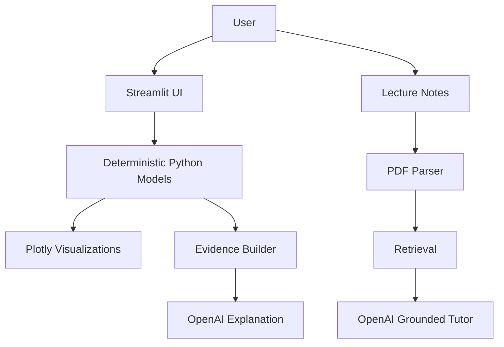

# OptiLearn AI

**AI-Powered Educational Digital Twin for Optical Communication**

`Educational Engineering Platform` · `Deterministic Python` · `Grounded OpenAI Assistance` · `Streamlit`

OptiLearn AI is an interactive engineering-education platform that combines deterministic optical-communication simulations, grounded tutoring from lecture notes, formative quizzes, and scalar optical-fiber mode exploration in one Streamlit application. It responds to a modern learning challenge: information is abundant, but meaningful engineering understanding still requires active reasoning, visualization, experimentation, evidence interpretation, and reflection.

Learn the equations, change the parameters, observe the physics, and test your understanding.

## Why This Matters

Students can now reach textbooks, videos, search engines, simulations, and AI-generated answers in seconds. That access is powerful, but it does not automatically create physical intuition or scientific judgement. Engineering learning still requires opportunities to test cause and effect, compare models, interpret evidence, and decide what a result can and cannot prove.

OptiLearn AI is designed to support that active process. Deterministic simulations create opportunities to change parameters and observe consequences. Grounded AI connects locally prepared evidence with explanation. Strong foundations in optical links, wave propagation, loss, dispersion, and modes prepare learners for future study in photonics, quantum communication, integrated optics, sensing, advanced networks, and next-generation computing systems. Lifelong learning remains essential for future engineers and scientists.

## Learning Outcomes the Platform Is Designed to Support

OptiLearn AI is designed to support conceptual understanding, modelling fluency, visualization and interpretation, critical evaluation, scientific communication, confidence and curiosity, and lifelong-learning habits. Formal educational evaluation remains future work; the application creates structured opportunities to practise these skills rather than claiming guaranteed outcomes.

## Why OptiLearn AI

Optical-communication courses often move quickly from equations to abstract system diagrams. OptiLearn AI gives learners a single workspace where they can upload notes, ask grounded questions, run deterministic calculations, inspect assumptions, and practise with locally graded quizzes.

## Live Demo


`Final Build Week Prototype` · `Deterministic Python` · `Grounded OpenAI Assistance` · `Streamlit`

OptiLearn AI is an interactive engineering-education platform that combines deterministic optical-communication simulations, grounded tutoring from lecture notes, formative quizzes, and scalar optical-fiber mode exploration in one Streamlit application.

Learn the equations, change the parameters, observe the physics, and test your understanding.

## Why OptiLearn AI

Optical-communication courses often move quickly from equations to abstract system diagrams. OptiLearn AI gives learners a single workspace where they can upload notes, ask grounded questions, run deterministic calculations, inspect assumptions, and practise with locally graded quizzes.

## Live Demo


A live deployment URL can be added after deployment. The app runs locally with `streamlit run app.py` and can be deployed to Streamlit Community Cloud.

## Core Features

- PDF lecture-note extraction with page-level provenance.
- Grounded AI Tutor for answers from retrieved lecture-note passages. **Requires OpenAI API access for live answers.**
- Fiber attenuation simulation.
- Chromatic dispersion demonstration.
- Free-Space Optical (FSO) link budget.
- AI explanation of deterministic simulation results. **Requires OpenAI API access for live explanations.**
- Deterministic Quiz Lab with local grading.
- LP-mode explorer for weak-guidance scalar modes.
- Gaussian launch coupling visualization.
- Meridional rays and skew rays.
- Transparent demo mode for labelled local AI-feature demonstrations when API access is unavailable.

## Learning Journey

1. Upload text-based optical-communication lecture notes.
2. Ask grounded questions with cited pages.
3. Explore deterministic fiber and FSO simulations.
4. Practise with Quiz Lab.
5. Investigate scalar LP modes, Gaussian launch coupling, meridional rays, and skew rays.

## Scientific Models

Fiber attenuation:

```text
A = alpha L
T = 10^(-A/10)
P_rx = P_tx T
```

Chromatic dispersion:

```text
Delta t = |D| Delta lambda L
```

FSO link budget:

```text
w_rx = w_0 + theta L
eta_geo = 1 - exp(-2a_rx^2/w_rx^2)
eta_point = exp(-2r_offset^2/w_rx^2)
```

LP modes:

```text
V = (2pi a/lambda) sqrt(n_1^2-n_2^2)
u^2 + w^2 = V^2
```

These models are educational approximations exposed on the Digital Twin and Mode Explorer pages.

## Architecture



## Deterministic Python versus OpenAI

Deterministic Python calculates scientific results, validates inputs, produces simulations, grades quizzes, solves scalar LP modes, and traces rays. OpenAI explains supplied deterministic results and answers from retrieved lecture-note evidence. OpenAI does not replace the calculators and does not modify deterministic outputs.

## Application Pages

- **Home**: project positioning, learning journey, and routes into key workflows.
- **Lecture Notes**: PDF extraction and study readiness.
- **Digital Twin**: fiber attenuation, chromatic dispersion, and FSO link budgets.
- **AI Tutor**: grounded answers from active lecture notes.
- **Quiz Lab**: deterministic formative quizzes.
- **Mode Explorer**: scalar LP modes, coupling, and ray propagation.

## Installation

Windows PowerShell:

```powershell
git clone <repository-url>
cd OptiLearn-AI
python -m venv .venv
.venv\Scripts\activate
python -m pip install --upgrade pip
python -m pip install -r requirements.txt
streamlit run app.py
```

macOS/Linux:

```bash
git clone <repository-url>
cd OptiLearn-AI
python -m venv .venv
source .venv/bin/activate
python -m pip install --upgrade pip
python -m pip install -r requirements.txt
streamlit run app.py
```

## Configuration

Optional environment variables:

- `OPENAI_API_KEY`: enables live AI Tutor answers and live simulation explanations.
- `OPENAI_MODEL`: defaults to `gpt-5-mini` when unset.
- `OPTILEARN_DEMO_MODE`: enable with `1`, `true`, `yes`, or `on` for clearly labelled local demo templates.

Deterministic simulations, Quiz Lab, and Mode Explorer do not require OpenAI. ChatGPT Plus does not include OpenAI API billing.

## Local Development

```bash
python -m py_compile app.py src/*.py
streamlit run app.py
```

## Streamlit Community Cloud Deployment

Add secrets in Streamlit Cloud only when live AI features are needed:

```toml
OPENAI_API_KEY = "..."
OPENAI_MODEL = "gpt-5-mini"
OPTILEARN_DEMO_MODE = "true"
```

Demo mode is optional and is clearly labelled as local, non-live AI output.

## Usage Examples

- Use `10110010`, `10 Gbit/s`, `1 mW`, `20 km`, and `0.2 dB/km` for a fiber-loss demo.
- Use `D = 17 ps/(nm·km)`, `0.1 nm`, and `20 km` for a dispersion demo.
- Use `1 km`, `10 mW`, `2 cm`, `1 mrad`, `20 cm`, `1 dB/km`, and zero pointing offset for an FSO demo.

## Demo Workflow

See [DEMO_SCRIPT.md](DEMO_SCRIPT.md) for a 3-to-5-minute hackathon walkthrough.

## Testing and Validation

Primary syntax check:

```bash
python -m py_compile app.py src/*.py
```

The codebase also supports deterministic regression checks for fiber attenuation, chromatic dispersion, FSO, Quiz Lab, LP modes, Gaussian coupling, meridional rays, and skew rays. Streamlit AppTest can be used for page-rendering and navigation regressions. This README does not claim continuous integration unless a CI workflow is added.

## Privacy and Security

- API keys are read from environment variables or Streamlit secrets and are not displayed.
- Uploaded PDF text remains session based and is not written to the repository.
- Quiz answers are graded locally.
- Mode and ray arrays are not sent to OpenAI.
- No telemetry, third-party tracking, learner accounts, or persistent analytics are added.

## Scientific Scope and Limitations

- No OCR.
- No BER/SNR/OSNR calculation.
- No photodetection model.
- No experimental-grade receiver model.
- No turbulence or scintillation.
- No full-vector optical modes.
- No FEM/BPM/FDTD.
- No persistent learner accounts.
- No long-term PDF storage.
- No professional certification.

## Repository Structure

```text
.
├── DEMO_SCRIPT.md
├── README.md
├── SUBMISSION.md
├── app.py
├── requirements.txt
└── src
    ├── ai_tutor.py
    ├── fso_simulator.py
    ├── lp_mode_solver.py
    ├── optical_simulator.py
    ├── pdf_parser.py
    ├── quiz_engine.py
    ├── ray_tracer.py
    ├── simulation_explainer.py
    ├── ui_components.py
    └── visualizations.py
```

## Future Extensions

Potential future work includes OCR, receiver-noise education modules, eye-diagram approximations, turbulence demonstrations, richer assessment analytics, and full-vector or BPM-style mode solvers. These are intentionally outside the final polish milestone.

## Hackathon Submission

See [SUBMISSION.md](SUBMISSION.md) for suggested Devpost copy, summaries, tags, privacy notes, limitations, and demo-video positioning.

## Author

Built as OptiLearn AI for OpenAI Build Week.

## License

MIT
